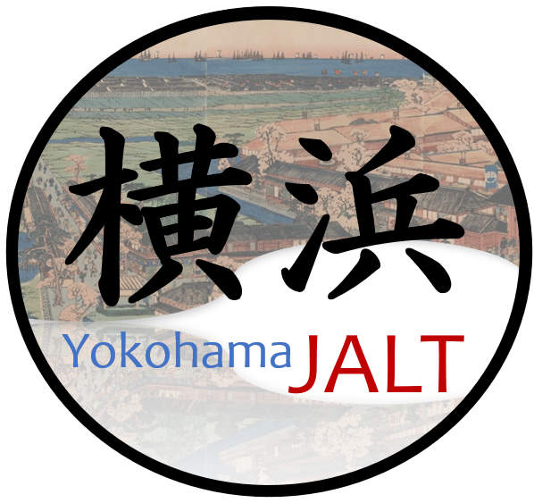
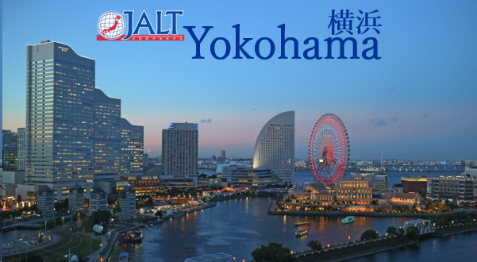
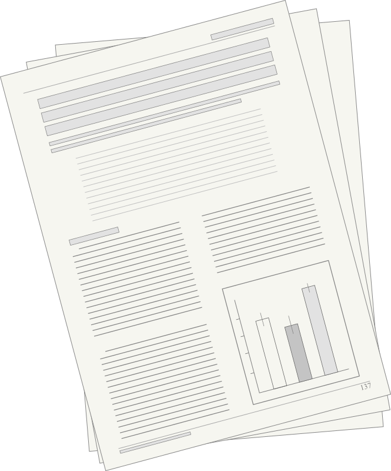

  <h1 style="font-size: 36px; margin-bottom: 20px; color: #159957;">
  Welcome to Yokohama JALT
  
</h1>

<a href="https://jalt.org/groups/chapters/yokohama"
   target="_blank"
   style="display:inline-block; padding:12px 24px; font-size:16px; color:white; background-color:#2c7be5; text-decoration:none; border-radius:8px;">
   Visit Our Official JALT-affiliated Page for Future Events and More
</a>

  

<a href="https://jalt.org/2026/04/30/call-for-papers-2027-scenario-conference-at-soka-university-march-24-27-2027/"
   target="_blank"
   style="display:inline-block; padding:12px 24px; font-size:16px; color:white; background-color:#28a745; text-decoration:none; border-radius:8px;">
   CALL FOR PAPERS: SCENARIO FORUM INTERNATIONAL CONFERENCE
</a>

 

<h2 style="text-align: center; font-size: 26px; font-weight: 600; color: #159957; margin: 50px 0 20px 0;">
  
  Guest Speakers
</h2>
We are an active and welcoming chapter that regularly hosts in-person and hybrid events, conveniently located between Yokohama and Tokyo. We invite a wide range of esteemed speakers from across the Kanto area and sometimes beyond, creating valuable opportunities for professional development and connection.

  <h2 style="font-size: 26px; font-weight: 600; color: #159957; margin: 0;">
    
    YoJALT My Share Events
  </h2>

We also host YoJALT My Share events, where teachers share practical ideas that can be quickly and easily implemented in the classroom. These sessions are open to both experienced and emerging educators from universities, schools, eikaiwa, and independent contexts, developing a supportive and collaborative environment. After the events, participants often continue the conversation at a nearby café or pub, building connections and expanding their professional networks.

<h2 style="text-align: center; font-size: 26px; font-weight: 600; color: #159957; margin: 50px 0 20px 0;">
  
  Publishing Opportunities
</h2>
Speakers also have the opportunity to publish their work in a special YoJALT My Share edition of [Accents Asia](https://accentsasia.org/). This free, open-access journal provides a platform for educators across East Asia to share their ideas and research with a wider community of teachers.

  <a href="https://www.facebook.com/groups/1475598610886199" target="_blank"
     style="display: inline-block; padding: 12px 28px; margin: 8px;
            background-color: #2d5f9a; color: white;
            text-decoration: none; border-radius: 4px;
            font-size: 15px; font-weight: 500;
            box-shadow: 0 2px 4px rgba(0,0,0,0.1);">
    Facebook
  </a>

  <a href="mailto:yojaltpresident@yojalt.org"
     style="display: inline-block; padding: 12px 28px; margin: 8px;
            background-color: #5a6268; color: white;
            text-decoration: none; border-radius: 4px;
            font-size: 15px; font-weight: 500;
            box-shadow: 0 2px 4px rgba(0,0,0,0.1);">
    Email Us
  </a>

  <a href="https://yojalt.us8.list-manage.com/subscribe?u=442e71f0713e8734324b000ca&id=dbf8d8a46b" target="_blank"
     style="display: inline-block; padding: 12px 28px; margin: 8px;
            background-color: #3a7d44; color: white;
            text-decoration: none; border-radius: 4px;
            font-size: 15px; font-weight: 500;
            box-shadow: 0 2px 4px rgba(0,0,0,0.1);">
    Join Mailing List
  </a>

  <a href="previousevents.html"
   style="display: inline-block; padding: 12px 28px; margin: 8px;
          background-color: #6f42c1; color: white;
          text-decoration: none; border-radius: 4px;
          font-size: 15px; font-weight: 500;
          box-shadow: 0 2px 4px rgba(0,0,0,0.1);">
  Previous Events
</a>

<a href="publications.html"
   style="display: inline-block; padding: 12px 28px; margin: 8px;
          background-color: #d39e00; color: white;
          text-decoration: none; border-radius: 4px;
          font-size: 15px; font-weight: 500;
          box-shadow: 0 2px 4px rgba(0,0,0,0.1);">
  Publications
</a>

